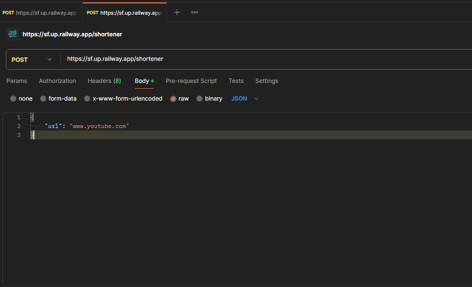
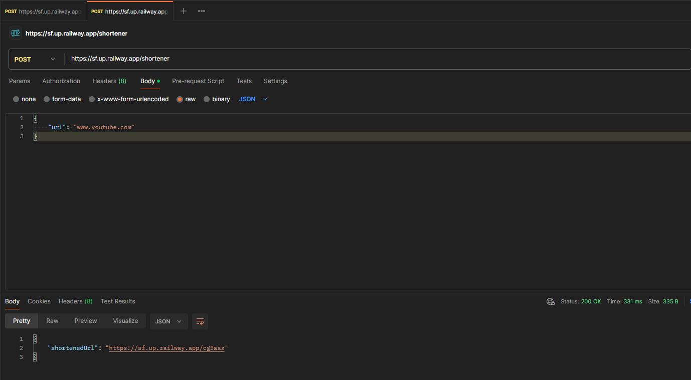
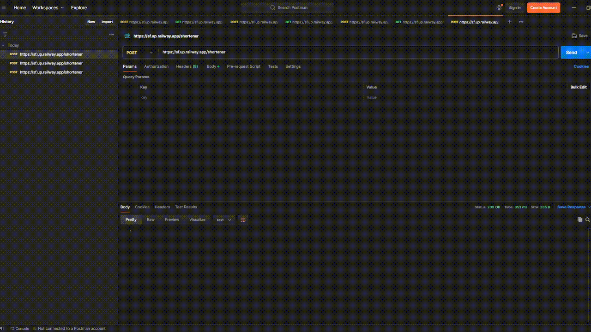

# Link Shortener

## Description
Welcome to **Link Shortener**, a personal project built with Maven, Java, Spring Boot, and MySQL.

> **Note:** This project is for practice purposes only.

## Try it out
You can test it using the following link:  
[https://sf.up.railway.app/shortener](http://sf.up.railway.app/shortener)

## How to Use
### 1. Using Postman
You can interact with the project by sending requests via Postman.
You should create a Post method and send the following JSON:
```json
{
    "url": "(your url)"
}
```



### 2. Api answer
The API return a short URL that you can copy and paste in your navigator.
This new link will redirect you to the original URL.



### 3. Example of use

